# Enterprise-SOC-Lab-Elastic-SIEM
Enterprise SOC Lab using Elastic SIEM, Sysmon, Fleet Server, Detection Engineering, Threat Hunting, and MITRE ATT&amp;CK Mapping.

# Enterprise SOC Lab

```mermaid
graph LR

subgraph Attack_Simulation["Attack Phase"]
    A[Kali Linux]
end

subgraph Defense_Ingestion["Telemetry & Ingestion"]
    B[Windows Endpoint]
    C[Elastic Agent / Sysmon]
end

subgraph Centralized_SIEM["Analysis & Response"]
    D[(Elasticsearch)]
    E[Kibana SIEM]
    F[SOC Analyst]
end

A -->|Attack Traffic| B
B -->|Windows Logs| C
C -->|HTTPS| D
D -->|Search & Analytics| E
E -->|Alerts & Investigation| F

style A fill:#4A154B,stroke:#333,stroke-width:2px,color:#fff
style B fill:#1F4E79,stroke:#333,stroke-width:2px,color:#fff
style C fill:#005F73,stroke:#333,stroke-width:2px,color:#fff
style D fill:#EE9B00,stroke:#333,stroke-width:2px,color:#fff
style E fill:#0A9396,stroke:#333,stroke-width:2px,color:#fff
style F fill:#9B2226,stroke:#333,stroke-width:2px,color:#fff

style Attack_Simulation fill:#ffffff,stroke:#d9534f
style Defense_Ingestion fill:#ffffff,stroke:#5bc0de
style Centralized_SIEM fill:#ffffff,stroke:#5cb85c
```

## Project Overview

This project demonstrates the design and implementation of a home-based Enterprise Security Operations Center (SOC) using the Elastic Stack. The lab collects Windows security telemetry with Sysmon and Elastic Agent, centralizes logs in Elasticsearch, and enables monitoring, detection engineering, and threat hunting through Kibana. Multiple attack simulations were performed to validate detections and map activity to the MITRE ATT&CK framework.

## Objectives

- Build an enterprise-style SIEM lab
- Collect Windows security telemetry
- Configure Fleet Server and Elastic Agent
- Monitor Sysmon events
- Simulate real-world attacks
- Develop detection rules
- Perform threat hunting
- Map detections to MITRE ATT&CK

## 🖥️ Lab Environment

The Enterprise SOC Lab was built in a virtualized environment using VMware Workstation. The lab consists of an attacker machine (Kali Linux), a victim endpoint (Windows 10), and the Elastic Stack for centralized log collection, monitoring, and threat detection.

| **Component** | **Description** |
|--------------|-----------------|
| **Host Machine** | Windows 11 Pro |
| **Hypervisor** | VMware Workstation |
| **Attacker Machine** | Kali Linux |
| **Victim Machine** | Windows 10 Pro |
| **SIEM Platform** | Elastic Stack (Elasticsearch & Kibana) |
| **Log Collection** | Elastic Agent |
| **Endpoint Monitoring** | Sysmon |
| **Agent Management** | Fleet Server |
| **Dashboard & Visualization** | Kibana |
| **Operating System Logs** | Windows Event Logs |
| **Threat Detection** | Elastic Security Detection Rules |
| **Threat Hunting** | Kibana Discover (KQL) |
